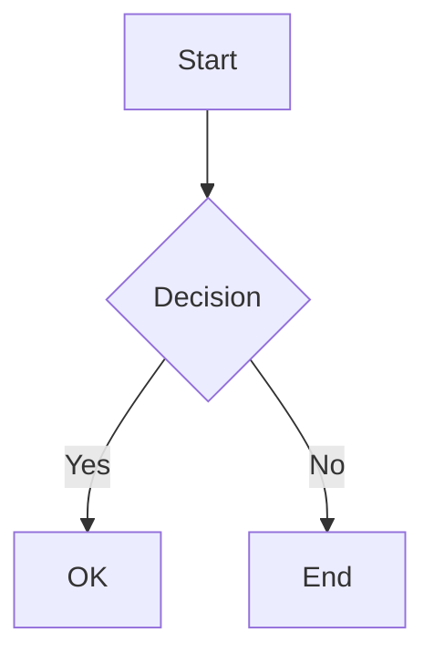

# md-http-server

A simple, fast HTTP server for rendering Markdown files with beautiful default styling.

## Features

- 📝 **Automatic Markdown Rendering** - View `.md` files as beautifully formatted HTML
- 📊 **Mermaid Diagram Support** - Render flowcharts, sequence diagrams, and more
- 🔄 **Live Reload** - Automatically refresh when markdown files change
- 📑 **Table of Contents** - Auto-generated TOC sidebar with active section highlighting
- 📁 **Directory Browsing** - Navigate through folders with an intuitive interface
- 🎨 **GitHub-style Styling** - Clean, readable default theme
- 🚀 **Zero Configuration** - Works out of the box
- 🔒 **Security** - Path traversal protection built-in
- 🔐 **Google OAuth** - Optional authentication to protect your content
- ⚡ **Fast** - Built with Express and Marked

## Installation

### Using npx (Recommended)

No installation required! Just run:

```bash
npx md-http-server
```

### Global Installation

```bash
npm install -g md-http-server
```

### Local Installation

```bash
npm install md-http-server
```

## Usage

### Basic Usage

Serve the current directory on port 3000:

```bash
npx md-http-server
```

### Serve a Specific Directory

```bash
npx md-http-server ./docs
```

### Custom Port

```bash
npx md-http-server -p 8080
```

### Live Reload

Enable automatic page refresh when markdown files change:

```bash
npx md-http-server --watch
```

### Verbose Logging

```bash
npx md-http-server -v
```

### Google OAuth Authentication

Protect your content with Google OAuth authentication:

```bash
npx md-http-server --auth
```

See [Authentication](#authentication) section for full setup instructions.

### All Options

```bash
npx md-http-server [directory] -p [port] -v -w --watch-debounce [ms] --auth --auth-config [path] --config [path]
```

**Arguments:**
- `directory` - Directory to serve (default: current directory)

**Options:**
- `-c, --config <path>` - Path to config file (JSON or YAML)
- `-p, --port <port>` - Port to listen on (default: 3000)
- `-v, --verbose` - Enable verbose logging
- `-w, --watch` - Enable live reload when markdown files change
- `--watch-debounce <ms>` - Debounce delay for file changes in milliseconds (default: 500)
- `--auth` - Enable Google OAuth authentication
- `--auth-config <path>` - Path to auth config file (default: `.md-server-auth.json`)
- `-V, --version` - Output version number
- `-h, --help` - Display help

**Subcommands:**
- `init` - Create a configuration file interactively
- `validate --config <path>` - Validate a configuration file

## Configuration File

Instead of passing options via command line, you can store all settings in a configuration file.

### Creating a Config File

**Interactive creation:**
```bash
npx md-http-server init
```

Answer the prompts to create `md-server.config.json`.

**Manual creation:**

Create `md-server.config.json` (JSON format):
```json
{
  "directory": "./docs",
  "port": 8080,
  "verbose": false,
  "watch": true,
  "watchDebounce": 500
}
```

Or `md-server.config.yaml` (YAML format):
```yaml
directory: ./docs
port: 8080
verbose: false
watch: true
watchDebounce: 500
```

### Using a Config File

```bash
npx md-http-server --config ./md-server.config.json
```

### Environment Variables

Use `${VAR_NAME}` syntax for sensitive values:

```json
{
  "authProvider": "GOOGLE",
  "authConfig": {
    "clientId": "${GOOGLE_CLIENT_ID}",
    "clientSecret": "${GOOGLE_CLIENT_SECRET}",
    "sessionSecret": "${SESSION_SECRET:-dev-secret-change-me}"
  }
}
```

The `:-` syntax provides a default value if the environment variable is not set.

### Configuration with Google OAuth

Full example with authentication:

```yaml
directory: ./docs
port: 8080
watch: true

authProvider: GOOGLE
authConfig:
  clientId: ${GOOGLE_CLIENT_ID}
  clientSecret: ${GOOGLE_CLIENT_SECRET}
  sessionSecret: ${SESSION_SECRET}
  allowedDomains:
    - yourcompany.com
```

### Priority Order

Settings are applied in this order (highest priority last):

1. Built-in defaults
2. Configuration file values
3. Command-line arguments

**Example:**
```bash
# Config file sets port to 8080, but CLI overrides to 3000
npx md-http-server --config config.json --port 3000
```

### Validating Config Files

Ensure your configuration file is valid:

```bash
npx md-http-server validate --config ./md-server.config.json
```

This checks:
- File format (valid JSON/YAML)
- Required fields when authentication is enabled
- Value types and ranges
- Environment variable references

### Available Options

| Option | Type | Default | Description |
|--------|------|---------|-------------|
| `directory` | string | `.` | Directory to serve |
| `port` | number | `3000` | Server port (1-65535) |
| `verbose` | boolean | `false` | Enable verbose logging |
| `watch` | boolean | `false` | Enable live reload |
| `watchDebounce` | number | `500` | Debounce delay in ms |
| `authProvider` | string/null | `null` | OAuth provider (`"GOOGLE"` or `null`) |
| `authConfig.clientId` | string | - | OAuth Client ID (required if authProvider set) |
| `authConfig.clientSecret` | string | - | OAuth Client Secret (required if authProvider set) |
| `authConfig.sessionSecret` | string | - | Session encryption secret |
| `authConfig.callbackUrl` | string | - | OAuth callback URL (auto-detected) |
| `authConfig.allowedDomains` | string[] | `[]` | Restrict login to email domains |

## Examples

### Documentation Server

Serve your project documentation:

```bash
cd my-project
npx md-http-server ./docs -p 8080
```

Then open http://localhost:8080 in your browser.

### Quick README Preview

Preview your README before committing:

```bash
npx md-http-server
# Open http://localhost:3000/README.md
```

### Notes Directory

Browse and view your markdown notes:

```bash
npx md-http-server ~/Documents/notes
```

### Development with Live Reload

Edit markdown files and see changes instantly:

```bash
npx md-http-server ./docs --watch --verbose
# Open http://localhost:3000/your-file.md
# Edit the file in your editor, save, and watch the browser auto-reload!
```

## Programmatic Usage

You can also use md-http-server as a library in your Node.js applications:

```typescript
import { createServer } from 'md-http-server';

const server = createServer({
  port: 3000,
  directory: './content',
  verbose: true,
  watch: true,
  watchDebounce: 500
});

await server.start();
```

### With Authentication

```typescript
import { createServer, loadAuthConfig } from 'md-http-server';

// Load auth config from file
const authResult = loadAuthConfig('./.md-server-auth.json');
if (!authResult.success) {
  console.error('Auth config error:', authResult.error);
  process.exit(1);
}

const server = createServer({
  port: 3000,
  directory: './content',
  authConfig: authResult.config
});

await server.start();
```

## Features in Detail

### Markdown Rendering

All `.md` files are automatically rendered as HTML with:
- GitHub Flavored Markdown support
- Syntax highlighting-ready styling
- Tables, lists, and blockquotes
- Inline code and code blocks
- Links and images

### Mermaid Diagram Support

Create beautiful diagrams directly in your markdown files using Mermaid syntax:

````markdown

````

Supported diagram types:
- **Flowcharts** - Decision trees and process flows
- **Sequence Diagrams** - Interaction timelines
- **Gantt Charts** - Project schedules
- **Class Diagrams** - UML class structures
- **State Diagrams** - State machines
- **Pie Charts** - Data visualization
- **Entity Relationship Diagrams** - Database schemas
- **Git Graphs** - Version control flows
- **User Journey Maps** - UX workflows

All diagrams are rendered client-side using [Mermaid.js](https://mermaid.js.org/).

### Live Reload

The live reload feature automatically refreshes your browser when markdown files change, making it perfect for writing and previewing documentation.

**How it works:**
1. Enable with the `--watch` flag
2. Open any markdown file in your browser
3. Edit and save the file in your text editor
4. The browser automatically reloads to show your changes

**Features:**
- ⚡ Fast change detection (< 1 second)
- 🔄 Automatic reconnection if connection drops
- 🎯 Only reloads the specific file being viewed
- ⏱️ Configurable debounce delay to prevent excessive reloads
- 🔌 Uses Server-Sent Events (SSE) for efficient real-time updates

**Example:**
```bash
# Start server with live reload
npx md-http-server --watch

# Custom debounce delay (wait 1 second after file changes)
npx md-http-server --watch --watch-debounce 1000
```

### Table of Contents

Automatically generates a Table of Contents for your markdown files with:
- 📑 Floating sidebar with all headings
- ✨ Active section highlighting as you scroll
- 🖱️ Smooth scrolling to sections
- 💾 Remembers open/closed state

You can also insert a TOC manually anywhere in your document using `[TOC]` or `[[toc]]`.

### Directory Browsing

When accessing a directory, you'll see:
- 📁 Folders (navigate to subdirectories)
- 📄 Markdown files (rendered as HTML)
- 📎 Other files (served as-is)
- Parent directory link (..) for navigation

### Authentication

Enable Google OAuth authentication to protect your markdown content.

#### Setup

1. **Create a Google Cloud Project**
   - Go to [Google Cloud Console](https://console.cloud.google.com/)
   - Create a new project or select existing one
   - Enable the "Google+ API" or "People API"

2. **Create OAuth Credentials**
   - Navigate to APIs & Services > Credentials
   - Create OAuth 2.0 Client ID
   - Application type: Web application
   - Add authorized redirect URI: `http://localhost:3000/__auth/callback`
   - Copy the Client ID and Client Secret

3. **Create Config File**

   Create `.md-server-auth.json` in your project root:

   ```json
   {
     "clientId": "YOUR_CLIENT_ID.apps.googleusercontent.com",
     "clientSecret": "YOUR_CLIENT_SECRET",
     "allowedDomains": ["example.com"]
   }
   ```

   **Config Options:**
   - `clientId` (required) - Google OAuth Client ID
   - `clientSecret` (required) - Google OAuth Client Secret
   - `callbackUrl` (optional) - Override auto-detected callback URL
   - `allowedDomains` (optional) - Restrict login to specific email domains
   - `sessionSecret` (optional) - Session encryption secret (auto-generated if not provided)
   - `sessionMaxAge` (optional) - Session duration in milliseconds (default: 24 hours)

4. **Start Server with Auth**

   ```bash
   npx md-http-server --auth
   ```

#### Domain Restriction

Restrict access to users from specific email domains:

```json
{
  "clientId": "...",
  "clientSecret": "...",
  "allowedDomains": ["company.com", "partner.org"]
}
```

Only users with `@company.com` or `@partner.org` email addresses can access the content.

#### Auth Routes

When authentication is enabled, these routes are available:
- `/__auth/login` - Initiates Google OAuth flow
- `/__auth/callback` - OAuth callback (internal use)
- `/__auth/error` - Displays authentication errors
- `/__logout` - Logs out current user

#### Security Considerations

- **Never commit `.md-server-auth.json`** - Add it to your `.gitignore`:
  ```
  .md-server-auth.json
  ```
- Uses PKCE (Proof Key for Code Exchange) for secure OAuth flow
- Sessions are stored in-memory (restarting server logs out all users)
- All routes are protected including static assets

### Security

The server includes built-in protections against:
- Path traversal attacks
- Access to files outside the served directory
- Directory escape attempts

## Requirements

- Node.js 18.0.0 or higher

## Development

### Setup

```bash
git clone <repository-url>
cd md-server
npm install
```

### Build

```bash
npm run build
```

### Development Mode

```bash
npm run dev
```

### Testing

```bash
npm test
```

## License

MIT

## Contributing

Contributions are welcome! Please feel free to submit a Pull Request.
