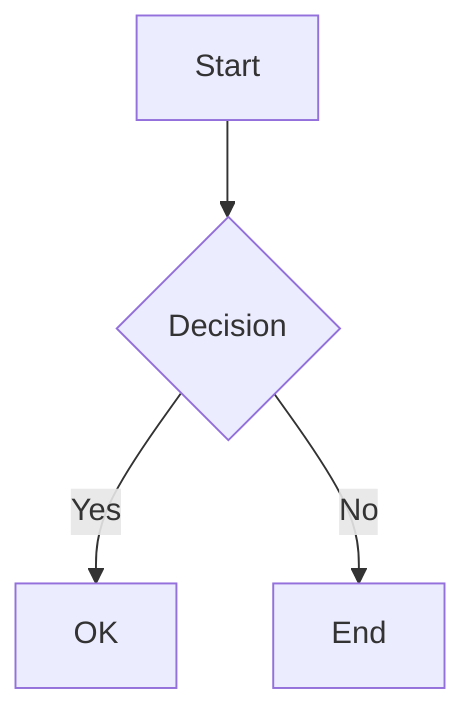

# md-http-server

A simple, fast HTTP server for rendering Markdown files with beautiful default styling.

## Features

- 📝 **Automatic Markdown Rendering** - View `.md` files as beautifully formatted HTML
- 📊 **Mermaid Diagram Support** - Render flowcharts, sequence diagrams, and more
- 📁 **Directory Browsing** - Navigate through folders with an intuitive interface
- 🎨 **GitHub-style Styling** - Clean, readable default theme
- 🚀 **Zero Configuration** - Works out of the box
- 🔒 **Security** - Path traversal protection built-in
- ⚡ **Fast** - Built with Express and Marked

## Installation

### Using npx (Recommended)

No installation required! Just run:

```bash
npx md-http-server
```

### Global Installation

```bash
npm install -g md-http-server
```

### Local Installation

```bash
npm install md-http-server
```

## Usage

### Basic Usage

Serve the current directory on port 3000:

```bash
npx md-http-server
```

### Serve a Specific Directory

```bash
npx md-http-server ./docs
```

### Custom Port

```bash
npx md-http-server -p 8080
```

### Verbose Logging

```bash
npx md-http-server -v
```

### All Options

```bash
npx md-http-server [directory] -p [port] -v
```

**Arguments:**
- `directory` - Directory to serve (default: current directory)

**Options:**
- `-p, --port <port>` - Port to listen on (default: 3000)
- `-v, --verbose` - Enable verbose logging
- `-V, --version` - Output version number
- `-h, --help` - Display help

## Examples

### Documentation Server

Serve your project documentation:

```bash
cd my-project
npx md-http-server ./docs -p 8080
```

Then open http://localhost:8080 in your browser.

### Quick README Preview

Preview your README before committing:

```bash
npx md-http-server
# Open http://localhost:3000/README.md
```

### Notes Directory

Browse and view your markdown notes:

```bash
npx md-http-server ~/Documents/notes
```

## Programmatic Usage

You can also use md-http-server as a library in your Node.js applications:

```typescript
import { createServer } from 'md-http-server';

const server = createServer({
  port: 3000,
  directory: './content',
  verbose: true
});

await server.start();
```

## Features in Detail

### Markdown Rendering

All `.md` files are automatically rendered as HTML with:
- GitHub Flavored Markdown support
- Syntax highlighting-ready styling
- Tables, lists, and blockquotes
- Inline code and code blocks
- Links and images

### Mermaid Diagram Support

Create beautiful diagrams directly in your markdown files using Mermaid syntax:

````markdown

````

Supported diagram types:
- **Flowcharts** - Decision trees and process flows
- **Sequence Diagrams** - Interaction timelines
- **Gantt Charts** - Project schedules
- **Class Diagrams** - UML class structures
- **State Diagrams** - State machines
- **Pie Charts** - Data visualization
- **Entity Relationship Diagrams** - Database schemas
- **Git Graphs** - Version control flows
- **User Journey Maps** - UX workflows

All diagrams are rendered client-side using [Mermaid.js](https://mermaid.js.org/).

### Directory Browsing

When accessing a directory, you'll see:
- 📁 Folders (navigate to subdirectories)
- 📄 Markdown files (rendered as HTML)
- 📎 Other files (served as-is)
- Parent directory link (..) for navigation

### Security

The server includes built-in protections against:
- Path traversal attacks
- Access to files outside the served directory
- Directory escape attempts

## Requirements

- Node.js 18.0.0 or higher

## Development

### Setup

```bash
git clone <repository-url>
cd md-server
npm install
```

### Build

```bash
npm run build
```

### Development Mode

```bash
npm run dev
```

### Testing

```bash
npm test
```

## License

MIT

## Contributing

Contributions are welcome! Please feel free to submit a Pull Request.
