# Interactive Config Generator Flow

**Feature**: 003-config-file
**Date**: 2025-11-28

## Flow Diagram


## Simplified View

```mermaid
flowchart LR
    subgraph Flow["Config Generator Flow"]
        direction TB

        Basic["📁 Basic\n(Directory, Port)"]
        LiveReload{"🔄 Live\nReload?"}
        Debounce["⏱️ Debounce"]
        Verbose["📝 Verbose"]
        Auth{"🔐 Auth?"}
        AuthConfig["🔑 OAuth Config\n(ID, Secret, Session)"]
        Access{"👥 Access\nControl?"}
        Emails["📧 Emails"]
        Domains["🌐 Domains"]
        Output["💾 Output File"]
        Done["✅ Done"]

        Basic --> LiveReload
        LiveReload -->|Yes| Debounce --> Verbose
        LiveReload -->|No| Verbose
        Verbose --> Auth
        Auth -->|No| Output
        Auth -->|Google| AuthConfig --> Access
        Access -->|Anyone| Output
        Access -->|Emails| Emails --> Output
        Access -->|Domains| Domains --> Output
        Access -->|Both| Emails --> Domains
        Domains --> Output
        Output --> Done
    end
```



## Conditional Paths


| Decision Point | Condition | Result |
|----------------|-----------|--------|
| Live reload? | No | Skip debounce prompt |
| Live reload? | Yes | Show debounce prompt |
| Auth? | No | Skip all auth config |
| Auth? | Google | Show OAuth config flow |
| Session secret? | Auto-generate | Skip manual entry |
| Session secret? | Custom | Show manual entry |
| Access? | Anyone | Skip emails/domains |
| Access? | Emails only | Show emails prompt |
| Access? | Domains only | Show domains prompt |
| Access? | Both | Show emails + domains |
| File exists? | No | Skip overwrite prompt |
| File exists? | Yes | Show overwrite prompt |
| Overwrite? | No | Show new filename prompt |

## Prompt Count by Path


## Prompt Details

### Basic Settings

| Prompt | Type | Default | Validation |
|--------|------|---------|------------|
| Directory | text | `.` | Must be valid path |
| Port | number | `3000` | 1-65535 |

### Developer Experience

| Prompt | Type | Default | Condition |
|--------|------|---------|-----------|
| Live reload | confirm | No | Always |
| Watch debounce | number | `500` | Only if live reload = Yes |
| Verbose logging | confirm | No | Always |

### Authentication

| Prompt | Type | Default | Condition |
|--------|------|---------|-----------|
| Enable auth | select | No | Always |
| Client ID | text | - | If auth = Google |
| Client Secret | password | - | If auth = Google |
| Session Secret | select | Auto-generate | If auth = Google |
| Custom session secret | password | - | If session = custom |
| Access control | select | Anyone | If auth = Google |
| Allowed emails | text | - | If access includes emails |
| Allowed domains | text | - | If access includes domains |

### Output

| Prompt | Type | Default | Condition |
|--------|------|---------|-----------|
| Output path | text | `md-server.config.json` | Always |
| Overwrite | confirm | - | If file exists |
| New filename | text | - | If overwrite = No |

## Sample Interactions

### Minimal Config (5 prompts)

```
? Directory to serve › .
? Server port › 3000
? Enable live reload? › No
? Enable verbose logging? › No
? Protect with authentication? › No, keep it open
? Output file › md-server.config.json

✓ Configuration saved to md-server.config.json
```

### Development Config (6 prompts)

```
? Directory to serve › ./docs
? Server port › 3000
? Enable live reload? › Yes
? Watch debounce in ms › 500
? Enable verbose logging? › Yes
? Protect with authentication? › No, keep it open
? Output file › md-server.config.json

✓ Configuration saved to md-server.config.json
```

### Full Auth Config (11 prompts)

```
? Directory to serve › ./docs
? Server port › 8080
? Enable live reload? › No
? Enable verbose logging? › No
? Protect with authentication? › Yes, use Google OAuth
? Google OAuth Client ID › 123456789.apps.googleusercontent.com
? Google OAuth Client Secret › ********
? Session Secret › Auto-generate
? Who should have access? › Only specific domains
? Allowed domains › company.com, partner.org
? Output file › config.yaml

✓ Configuration saved to config.yaml
```
