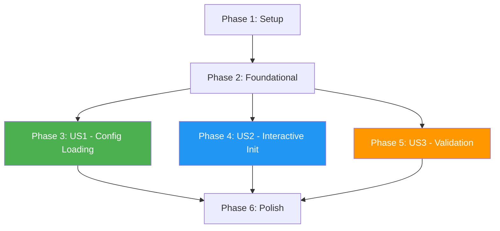

# Tasks: Config File Support with Interactive Generator

**Input**: Design documents from `/specs/003-config-file/`
**Prerequisites**: plan.md, spec.md, research.md, data-model.md, contracts/cli-contract.md, init-flow.md

**Tests**: Not included (no test framework currently in place per plan.md)

**Organization**: Tasks are grouped by user story to enable independent implementation and testing of each story.

## Format: `[ID] [P?] [Story] Description`

- **[P]**: Can run in parallel (different files, no dependencies)
- **[Story]**: Which user story this task belongs to (e.g., US1, US2, US3)
- Include exact file paths in descriptions

## Path Conventions

- **Single project**: `src/`, `tests/` at repository root
- All paths use `src/` structure as defined in plan.md

---

## Phase 1: Setup (Shared Infrastructure)

**Purpose**: Install dependencies and create project structure for config module

- [x] T001 Install js-yaml dependency: `npm install js-yaml && npm install -D @types/js-yaml`
- [x] T002 Install @inquirer/prompts dependency: `npm install @inquirer/prompts`
- [x] T003 Create config module directory structure: `src/config/`
- [x] T004 Create commands module directory structure: `src/commands/`

---

## Phase 2: Foundational (Blocking Prerequisites)

**Purpose**: Core types and utilities that ALL user stories depend on

**CRITICAL**: No user story work can begin until this phase is complete

- [x] T005 [P] Define config type constants (CONFIG_FORMATS, AUTH_PROVIDERS, SETTING_TYPES) in `src/config/types.ts`
- [x] T006 [P] Define ServerConfig, AuthConfig, AuthProvider interfaces in `src/config/types.ts`
- [x] T007 [P] Define ValidationResult, ValidationError, ValidationWarning types in `src/config/types.ts`
- [x] T008 [P] Define SettingDefinition type for interactive prompts in `src/config/types.ts`
- [x] T009 Implement environment variable expansion function `expandEnvVars()` in `src/config/env.ts`
- [x] T010 Implement config validation functions (validatePort, validateDirectory, validateAuth) in `src/config/validator.ts`
- [x] T011 Create config module barrel export in `src/config/index.ts`

**Checkpoint**: Foundation ready - user story implementation can now begin ✓

---

## Phase 3: User Story 1 - Run CLI with Config File (Priority: P1) MVP

**Goal**: Users can run `md-http-server --config ./config.json` to start the server with settings from a config file

**Independent Test**: Create a config file manually, run CLI with `--config` flag, verify server starts with correct settings

### Implementation for User Story 1

- [x] T012 [US1] Implement config file format detection (JSON/YAML by extension) in `src/config/loader.ts`
- [x] T013 [US1] Implement JSON config file parsing in `src/config/loader.ts`
- [x] T014 [US1] Implement YAML config file parsing using js-yaml in `src/config/loader.ts`
- [x] T015 [US1] Implement config file loading with env var expansion in `src/config/loader.ts`
- [x] T016 [US1] Implement config + CLI args merger (CLI takes precedence) in `src/config/merger.ts`
- [x] T017 [US1] Add `--config` / `-c` option to commander in `src/cli.ts`
- [x] T018 [US1] Integrate config loading into CLI action handler in `src/cli.ts`
- [x] T019 [US1] Implement error handling for missing config file with actionable message in `src/config/loader.ts`
- [x] T020 [US1] Implement error handling for parse errors with line numbers in `src/config/loader.ts`
- [x] T021 [US1] Implement warning for unknown config fields in `src/config/validator.ts`

**Checkpoint**: User Story 1 complete - server can be started with `--config` flag ✓

---

## Phase 4: User Story 2 - Interactive Config File Generator (Priority: P2)

**Goal**: Users can run `md-http-server init` to interactively create a config file

**Independent Test**: Run `md-http-server init`, answer prompts, verify valid config file is created

### Implementation for User Story 2

- [x] T022 [US2] Define setting definitions array with descriptions, defaults, validators in `src/commands/init.ts`
- [x] T023 [US2] Implement welcome banner display in `src/commands/init.ts`
- [x] T024 [US2] Implement basic settings prompts (directory, port) in `src/commands/init.ts`
- [x] T025 [US2] Implement developer experience prompts with conditional logic (live reload → debounce) in `src/commands/init.ts`
- [x] T026 [US2] Implement auth provider selection prompt in `src/commands/init.ts`
- [x] T027 [US2] Implement conditional auth config prompts (client ID, secret, session secret) in `src/commands/init.ts`
- [x] T028 [US2] Implement access control prompts with conditional logic (anyone/emails/domains/both) in `src/commands/init.ts`
- [x] T029 [US2] Implement session secret auto-generation option in `src/commands/init.ts`
- [x] T030 [US2] Implement output file path prompt with format detection in `src/commands/init.ts`
- [x] T031 [US2] Implement file exists check and overwrite confirmation in `src/commands/init.ts`
- [x] T032 [US2] Implement config file writing (JSON and YAML formats) in `src/commands/init.ts`
- [x] T033 [US2] Implement summary display with next steps in `src/commands/init.ts`
- [x] T034 [US2] Implement graceful Ctrl+C handling (no partial file) in `src/commands/init.ts`
- [x] T035 [US2] Add `init` subcommand to commander with options (-o, -f, -y) in `src/cli.ts`
- [x] T036 [US2] Implement `--yes` flag for non-interactive mode with defaults in `src/commands/init.ts`

**Checkpoint**: User Story 2 complete - users can generate config files interactively ✓

---

## Phase 5: User Story 3 - Config File Validation (Priority: P3)

**Goal**: Users can run `md-http-server validate --config ./config.json` to validate a config file

**Independent Test**: Create config files with various errors, run validate command, verify appropriate error messages

### Implementation for User Story 3

- [x] T037 [US3] Implement validation result formatting with errors and warnings in `src/commands/validate.ts`
- [x] T038 [US3] Implement success message display with settings count in `src/commands/validate.ts`
- [x] T039 [US3] Implement error message display with hints in `src/commands/validate.ts`
- [x] T040 [US3] Implement `--quiet` flag for CI/CD mode in `src/commands/validate.ts`
- [x] T041 [US3] Add `validate` subcommand to commander with required --config option in `src/cli.ts`
- [x] T042 [US3] Implement exit code 0 for valid, 1 for invalid in `src/commands/validate.ts`

**Checkpoint**: User Story 3 complete - users can validate config files before use ✓

---

## Phase 6: Polish & Cross-Cutting Concerns

**Purpose**: Improvements that affect multiple user stories

- [x] T043 [P] Update README.md with config file documentation
- [x] T044 [P] Add config file examples to repository root (example.config.json, example.config.yaml)
- [x] T045 Update --help output to mention config file support in `src/cli.ts`
- [x] T046 Run quickstart.md validation scenarios manually
- [x] T047 Update package.json version for new feature release

**Checkpoint**: All tasks complete - Feature ready for release ✓

---

## Dependencies & Execution Order

### Phase Dependencies



- **Setup (Phase 1)**: No dependencies - can start immediately
- **Foundational (Phase 2)**: Depends on Setup completion - BLOCKS all user stories
- **User Stories (Phase 3-5)**: All depend on Foundational phase completion
  - US1 (Config Loading): Independent, required for MVP
  - US2 (Interactive Init): Uses types from foundational, uses loader from US1 for validation
  - US3 (Validation): Uses loader and validator from foundational + US1
- **Polish (Phase 6)**: Depends on all user stories being complete

### User Story Dependencies

- **User Story 1 (P1)**: Can start after Foundational (Phase 2) - No dependencies on other stories
- **User Story 2 (P2)**: Can start after Foundational (Phase 2) - Reuses loader.ts from US1 for validation
- **User Story 3 (P3)**: Can start after Foundational (Phase 2) - Reuses loader.ts and validator.ts

### Within Each User Story

- Types before implementation
- Loader before CLI integration
- Core implementation before edge cases
- Story complete before moving to next priority

### Parallel Opportunities

**Phase 2 (Foundational)**:
- T005, T006, T007, T008 can run in parallel (different type definitions)

**Phase 6 (Polish)**:
- T043, T044 can run in parallel (different files)

---

## Parallel Example: Foundational Phase

```bash
# Launch all type definitions together:
Task: "Define config type constants in src/config/types.ts"
Task: "Define ServerConfig, AuthConfig interfaces in src/config/types.ts"
Task: "Define ValidationResult types in src/config/types.ts"
Task: "Define SettingDefinition type in src/config/types.ts"
```

---

## Implementation Strategy

### MVP First (User Story 1 Only)

1. Complete Phase 1: Setup (T001-T004)
2. Complete Phase 2: Foundational (T005-T011)
3. Complete Phase 3: User Story 1 (T012-T021)
4. **STOP and VALIDATE**: Test with manual config file
5. Deploy/demo if ready - users can use config files

### Incremental Delivery

1. Setup + Foundational → Foundation ready
2. Add User Story 1 → Test with `--config` flag → Deploy (MVP!)
3. Add User Story 2 → Test `md-http-server init` → Deploy
4. Add User Story 3 → Test `md-http-server validate` → Deploy
5. Each story adds value without breaking previous stories

---

## Task Summary

| Phase | Task Range | Count | Purpose |
|-------|------------|-------|---------|
| Setup | T001-T004 | 4 | Install dependencies, create directories |
| Foundational | T005-T011 | 7 | Core types and utilities |
| US1: Config Loading | T012-T021 | 10 | Load and use config files |
| US2: Interactive Init | T022-T036 | 15 | Generate config interactively |
| US3: Validation | T037-T042 | 6 | Validate config files |
| Polish | T043-T047 | 5 | Documentation and cleanup |
| **Total** | | **47** | |

---

## Notes

- [P] tasks = different files, no dependencies
- [Story] label maps task to specific user story for traceability
- Each user story is independently completable and testable
- No test tasks included (no test framework per plan.md)
- Commit after each task or logical group
- Stop at any checkpoint to validate story independently
